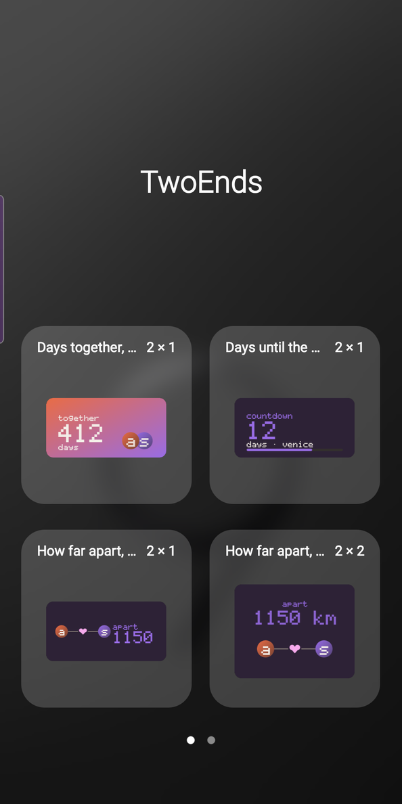
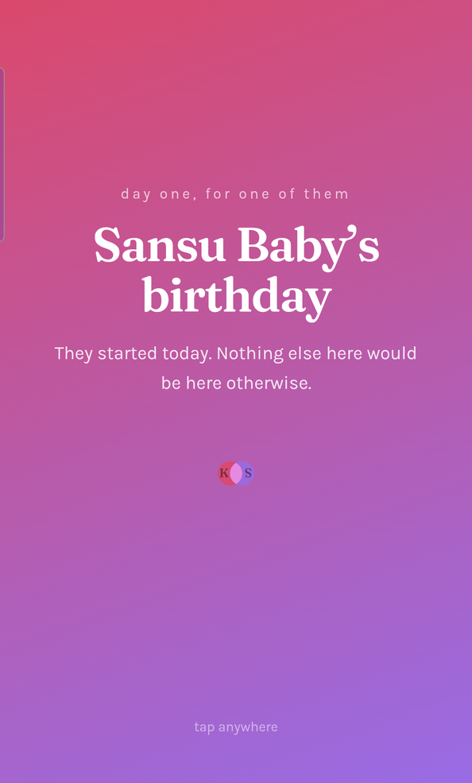
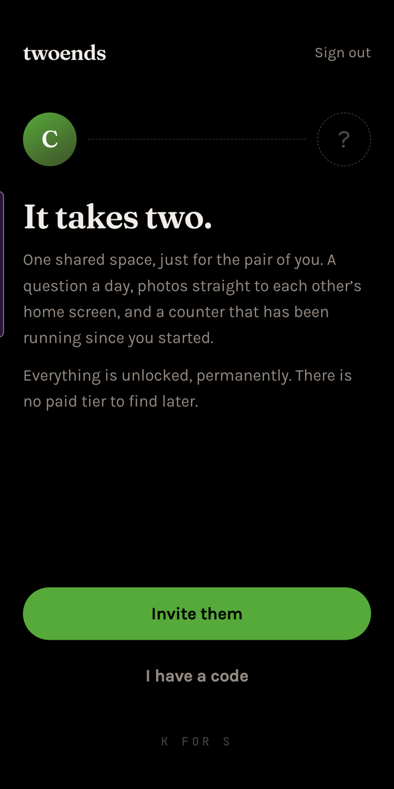

# TwoEnds

A free app for two people. Everything the paid apps in this space put behind a
subscription is free here, permanently — every question pack, every widget,
every game.

**In use.** Shipped as a PWA and a sideloaded Android APK, and used daily by real
couples, which is where most of the interesting bugs in this repository came
from.

**[Open it →](https://krishn1301.github.io/twoends/)** · **[Android APK →](https://github.com/krishn1301/twoends/releases/latest/download/TwoEnds.apk)**

On iPhone, open the link and add it to the Home Screen. On Android, install the
APK — it is the same app plus the six home-screen widgets, which iOS does not
give to web apps.

<p align="center">
  
  
  
</p>

## The one job

Make it feel like the other person is nearby, without either of them having to
open the app.

That is why home-screen widgets are the core feature rather than a bonus. A
version of this without widgets is a chat app with extra steps.

## What is in it

A daily question with a both-must-answer reveal · a shared canvas · daily photos
that expire in 30 days unless either partner keeps them · an anniversary counter
· countdowns · a streak that forgives two missed days a month · a journal ·
distance apart · a shared list · time capsules · three games · and **six
home-screen widgets** on Android.

## Three things worth reading the code for

**The reveal is a Postgres policy, not a curtain.** "You cannot see their answer
until you have written your own" is the core mechanic, and a client that receives
both answers and declines to render one has implemented a *delay* — anybody with
dev tools can skip a delay. So it lives in a restrictive row-level-security
policy, with a `security definer` function to dodge the infinite recursion a
policy querying its own table causes. See
[`00000000000008_reveal_recursion.sql`](supabase/migrations/00000000000008_reveal_recursion.sql)
and [`00000000000016_game.sql`](supabase/migrations/00000000000016_game.sql).

**The location feature is enforced by the database, not the app.** Sharing is
off by default and per person; readings are coarsened to a grid by a trigger;
withdrawing consent re-coarsens the *partner's* stored row without them opening
the app; and the read policy stops matching when the subject stops sharing. The
widget is handed two finished strings and never a number it could turn back into
a position. See
[`00000000000013_location.sql`](supabase/migrations/00000000000013_location.sql).

**The widgets are drawn from a snapshot, and count dates themselves.** Six
background processes holding auth tokens is how a widget gets uninstalled, so the
app pushes a snapshot and the widget process never touches the network. Dates are
stored as anchors and counted at draw time, so a widget the launcher has not
redrawn since yesterday still says the right thing this morning. Kotlin and
Jetpack Glance, in
[`apps/web/android/…/widget`](apps/web/android/app/src/main/java/com/twoends/app/widget).

## Security

A couple app that leaks between couples is not a bug, it is the end of the
project. So:

- Row-level security on every table, built from one predicate — are you one of
  the two members of this couple?
- Storage is three private buckets, secured by the same predicate. Never a
  public bucket.
- A migration-time guard fails the deploy if any table has RLS switched off.
- [`supabase/tests/`](supabase/tests) holds a **leak suite**: three users, two
  couples, asserting that a stranger reads zero rows and cannot write to any
  table or bucket. Every "they see nothing" assertion is paired with a "the
  partner sees it" one, so the suite cannot pass against an empty database. One
  test compares the table list against the API's own catalogue and fails on any
  new table nobody has covered — it has caught three.

The suite runs before every merge, and **it has been made to fail on purpose to
prove it works**: a policy was deliberately dropped, the suite went red on
exactly the right assertion, and it was restored.

## Deliberate constraints

- **Free means free.** No tier, no unlock, no "pro" badge, no ads, no upsell
  surface anywhere in the UI.
- **Two people, one pair.** No feeds, no discovery, no other users. There is no
  social graph and there never will be.
- **Offline first.** Every screen renders from local data; the network is an
  enhancement.
- **No dependency with a paid tier we would need.** The ZIP writer for the
  export and the PNG encoder for the icons and widget previews are both written
  by hand, because pulling a library for either would have been a supply-chain
  risk and a cold-start cost for about sixty lines.
- **The data belongs to them.** Full export, and a delete that actually deletes —
  storage first, while the policies still match, then a check of what survived.

## Stack

React 19 · TypeScript · Vite 8 · Tailwind 4 · Dexie (local-first) · Supabase
(Postgres, RLS, Storage, Edge Functions) · Capacitor · Kotlin + Jetpack Glance
for the Android widgets · Web Push, encrypted by hand.

`packages/core` has no platform imports, enforced by a test. That was written in
Phase 0 for tidiness, and it is what later let a Deno edge function import and
run the *same* "what day is it" rule the two phones run, rather than a second
copy of it in SQL that would drift.

## Testing

| | |
|---|---|
| **270** unit tests | `pnpm check` — typecheck, lint, vitest. The gate before every commit. |
| **86** leak assertions | `pnpm test:rls` — cross-couple isolation, against a real Postgres. |
| Per-feature RLS suites | the reveal, pairing, capsules, the guessing game, consent, quiet mode |
| CI | builds and signature-verifies the APK on every push, and publishes a signed release on a tag |

## Running it

```bash
pnpm install
cp .env.example .env.local     # then fill in from your own Supabase project
pnpm dev
```

| Command         | Does                                              |
| --------------- | ------------------------------------------------- |
| `pnpm check`    | typecheck, lint, unit tests — the gate            |
| `pnpm test:rls` | the cross-couple leak suite, against the database |
| `pnpm db:push`  | apply migrations                                  |
| `pnpm db:types` | regenerate types from the live schema             |
| `pnpm occasions`| print which days the app will mark, and when      |
| `pnpm deploy`   | build and publish to GitHub Pages                 |

## Self-hosting

Point it at your own Supabase project and it is yours: apply
`supabase/migrations/` in order, fill in `.env.local`, and build. Nothing here
phones home, there is no analytics SDK, and the only third party is the database
you chose. See [`docs/SELFHOST.md`](docs/SELFHOST.md).

## Licence

[MIT](LICENSE).
